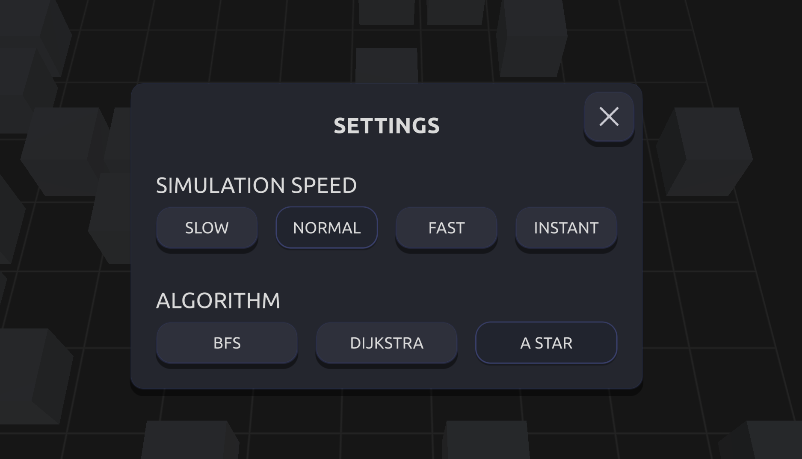
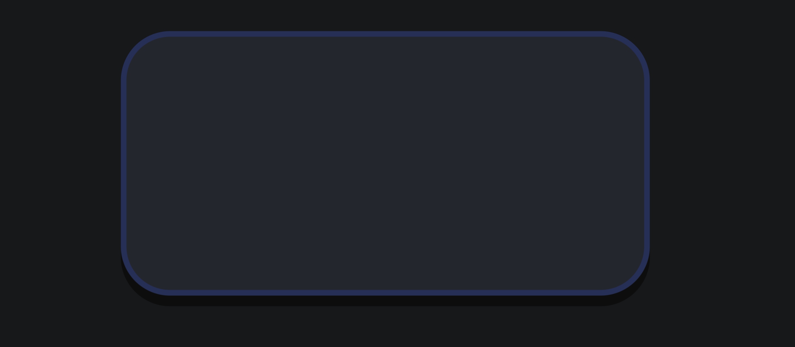
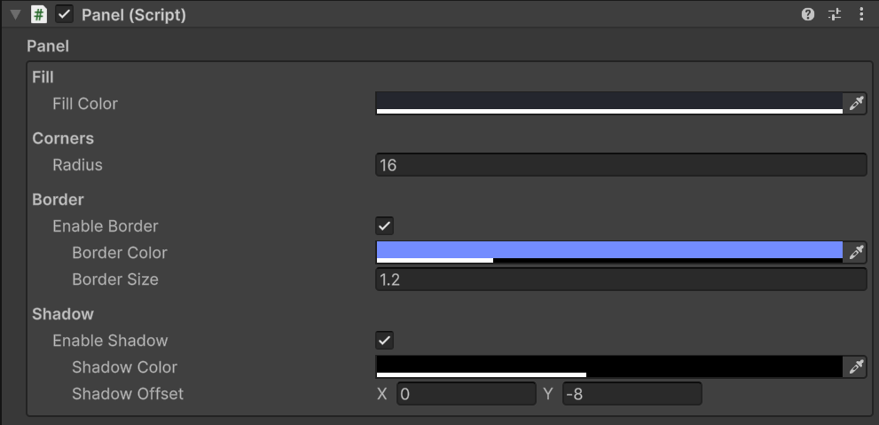
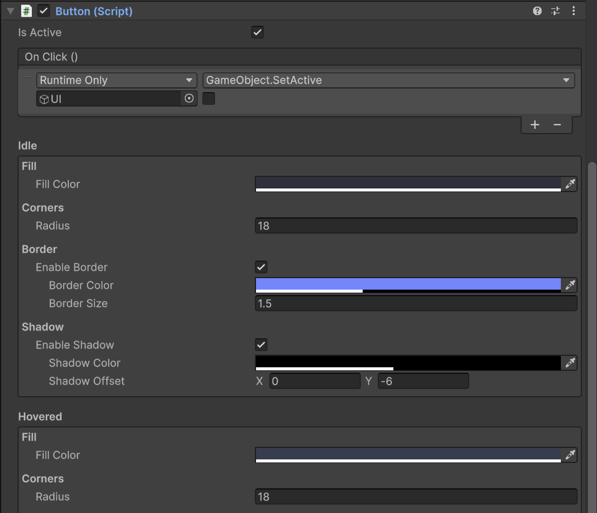
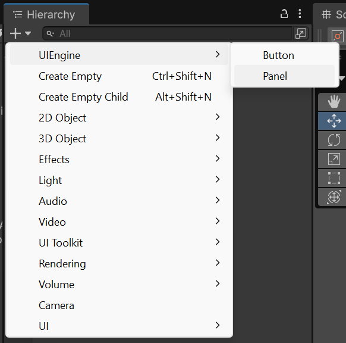

# UIEngine

UIEngine is a custom UI framework for Unity, delivered as a Unity package.
It provides a shader-driven, state-based UI system focused on clean visuals, deterministic behavior, and explicit control.

The framework intentionally avoids Unity’s default UI styling and transition systems, offering a predictable, code-first approach suitable for runtime UI, tools, and editor extensions.

---

## Visual Overview

UIEngine integrated into a real project.
The screenshot comes from an external repository where UIEngine is used as the primary UI layer:
https://github.com/jakub-wegner/PathfindingVisualizer

Panels and Buttons are rendered fully in shader space with rounded corners, borders, and shadows, without relying on Unity’s default UI styling system.

---

## Unity Version

- Unity 6.3
- Universal Render Pipeline (URP only)

---

## Example Panel View

A single Panel element showcasing fill color, border, corner radius, and shadow rendered procedurally using Signed Distance Field (SDF) functions.

---

## Overview

UIEngine is built around:
- a custom HLSL UI shader
- a strict visual state system
- lightweight, reusable C# components

All visuals are rendered procedurally in shader space, while interaction logic is handled explicitly through C# components.

This design provides:
- resolution-independent rendering
- no sprites, atlases, or slicing
- consistent visuals across platforms
- predictable interaction behavior

---

## Core Components

UIEngine currently includes two fundamental UI elements.

### Panel

A non-interactive UI element used for:
- backgrounds
- layout containers
- visual grouping

The Panel uses a single visual state, fully controlled through shader parameters.

---

### Button

A fully interactive UI element with four visual states:
- Idle
- Hovered
- Pressed
- Inactive

The Button:
- supports onClick callbacks
- exposes an isActive toggle
- automatically updates its visual state based on interaction and activity

---

## Visual State System

Both Panel and Button share the same visual state definition.

Each state controls:
- Fill Color
- Corner Radius
- Border
  - enable / disable
  - color
  - size
- Shadow
  - enable / disable
  - color
  - offset

This ensures visual consistency while allowing per-state customization.

---

## Rendering and Shader

UIEngine uses a single custom UI shader based on Signed Distance Field (SDF) techniques.

The shader provides:
- analytically computed rounded corners
- procedurally generated borders and shadows
- no texture-based styling
- stable rendering under scaling and resizing

The SDF-based approach makes the UI efficient, scalable, and visually consistent, even during dynamic layout changes or animation.

---

## Editor Tools

UIEngine includes custom inspectors for all components.

Panel Inspector:
- exposes only visual parameters
- hides internal rendering details

Button Inspector:
- clear layout for all visual states
- easy onClick assignment
- explicit control of interaction and active state

---

## Creation Tools

UIEngine provides editor creator scripts for fast and safe setup.

UI elements can be created via:
- the Hierarchy "+" menu
- right-click in the Hierarchy

Available options:
- UIEngine/Panel
- UIEngine/Button

Each creator:
- creates the GameObject
- adds all required components
- assigns the correct shader and default values
- ensures proper Canvas configuration

---

## Package Design

- structured as a Unity package
- hosted on GitHub
- no external dependencies
- designed to be extended with additional UI components

---

## Installation

UIEngine can be added using the Unity Package Manager via a Git URL.

Window → Package Manager → Add package from Git URL…

UIEngine supports URP only.

---

## Technologies

- Unity 6.3
- C#
- HLSL
- Universal Render Pipeline (URP)
